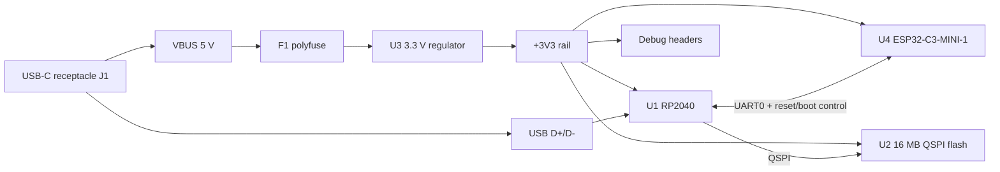

# Minimal RP2040 + ESP32-C3 Board — Schematic First Pass

This schematic-first design is a compact USB-powered board with an RP2040 as the main MCU and an ESP32-C3-MINI-1 module for Wi-Fi/BLE. The ESP32-C3 is specified as a module rather than a bare chip to keep the board minimal and avoid RF matching/antenna complexity.

## Design Sources Read

The repository PDFs reviewed for this first pass are:

- `RP-008279-DS-1-hardware-design-with-rp2040.pdf` — RP2040 hardware design guidance.
- `RP-008371-DS-1-rp2040-datasheet.pdf` — RP2040 pin, power, boot, USB, QSPI, and reset requirements.
- `esp-hardware-design-guidelines-en-master-esp32c3.pdf` — ESP32-C3 hardware layout, power, strapping, USB/UART, reset, and RF/module guidance.
- `esp32-c3_datasheet_en.pdf` — ESP32-C3 electrical, strapping, pin, power, and boot requirements.

## Schematic Overview

## Power Input and Regulation

| Ref | Part / value | Connections | Notes |
| --- | --- | --- | --- |
| J1 | USB-C 2.0 receptacle | VBUS, GND, D+, D-, CC1, CC2 | Single upstream-facing USB device port. |
| R1, R2 | 5.1 kΩ | CC1→GND, CC2→GND | Advertises default USB sink current. |
| F1 | 500 mA resettable fuse | USB VBUS→VBUS_FUSED | Basic USB input protection. |
| D1 | 5 V TVS | VBUS_FUSED→GND | Optional but recommended near connector. |
| U3 | 3.3 V LDO, ≥600 mA peak | IN=VBUS_FUSED, OUT=+3V3 | Must handle RP2040 plus ESP32-C3 transmit peaks. Suggested class: AP2112K-3.3, TLV75533P, or equivalent. |
| C1 | 10 µF | VBUS_FUSED→GND | Near U3 input. |
| C2 | 10 µF | +3V3→GND | Near U3 output. |
| C3 | 100 nF | +3V3→GND | Near U3 output. |
| TP1 | test point | +3V3 | Bring-up measurement. |
| TP2 | test point | GND | Bring-up measurement. |

## RP2040 Core Sheet

| Ref | RP2040 pin / net | Connection | Notes |
| --- | --- | --- | --- |
| U1 | IOVDD pins | +3V3 with one 100 nF each | Place decouplers close to every supply pin. |
| U1 | DVDD pins | Decouple to GND with 100 nF each | Generated internally; do not tie to +3V3. |
| U1 | VREG_VIN | +3V3, 1 µF to GND | Internal core regulator input. |
| U1 | VREG_VOUT | 1 µF to GND only | Internal regulator output. |
| U1 | USB_VDD | +3V3, 100 nF to GND | USB PHY supply. |
| U1 | ADC_AVDD | +3V3 through FB1 or 10 Ω, 100 nF + 1 µF to GND | Optional filter; keeps analog rail quiet. |
| U1 | RUN | R3 10 kΩ to +3V3, SW1 to GND | Reset button. Also routed to debug header. |
| U1 | USB_DP / USB_DM | J1 D+ / D- through 27 Ω series resistors R4/R5 | Route as short differential pair. |
| U1 | XIN/XOUT | Y1 12 MHz crystal, C4/C5 load caps | Crystal optional if using a qualified clock design; included for robust USB timing. |
| U1 | GPIO25 | LED1 via R6 1 kΩ to +3V3 or GND | User/status LED. |
| U1 | SWCLK/SWDIO | J2 debug header | 3V3, GND, SWCLK, SWDIO, RUN. |
| U1 | TESTEN | GND | Required normal operation state. |

## RP2040 External QSPI Flash

| Ref | Flash pin / net | RP2040 connection | Notes |
| --- | --- | --- | --- |
| U2 | VCC | +3V3, C6 100 nF to GND | 3.3 V QSPI NOR, e.g. W25Q128JV or smaller if desired. |
| U2 | GND | GND | — |
| U2 | CS# | RP2040 QSPI_SS_N | Dedicated flash chip select. |
| U2 | SCLK | RP2040 QSPI_SCLK | Keep short. |
| U2 | IO0..IO3 | RP2040 QSPI_SD0..SD3 | Keep short and length-similar. |
| U2 | WP#/HOLD# | QSPI IO2/IO3 function | Use quad-capable flash wiring. |

## ESP32-C3 Module Sheet

Use an **ESP32-C3-MINI-1** or equivalent certified module to keep the schematic and layout minimalist.

| Ref | ESP32-C3-MINI-1 pin / net | Connection | Notes |
| --- | --- | --- | --- |
| U4 | 3V3 | +3V3 with C7 10 µF + C8 100 nF close | Provide low-impedance rail for RF current bursts. |
| U4 | GND | Solid ground | Stitch ground around module. |
| U4 | EN | R7 10 kΩ to +3V3, C9 100 nF to GND, optional SW2 to GND | Reset/enable. |
| U4 | IO9 / BOOT | R8 10 kΩ to +3V3, SW3 to GND | Download-mode button. |
| U4 | U0TXD | RP2040 GPIO1 / UART0_RX | RP2040 command/control UART. |
| U4 | U0RXD | RP2040 GPIO0 / UART0_TX | RP2040 command/control UART. |
| U4 | IO18 / USB_D- | J3 optional ESP USB D- header | Leave unpopulated unless direct ESP flashing over USB is desired. |
| U4 | IO19 / USB_D+ | J3 optional ESP USB D+ header | Keep stubs short if fitted. |
| U4 | IO2 | R9 10 kΩ pull-up to +3V3; optional header | Keep valid boot strap state. |
| U4 | IO8 | R10 10 kΩ pull-up to +3V3; optional header | Keep valid boot strap state. |
| U4 | GPIOs spare | J4 expansion header | Expose only non-critical pins for simplicity. |

## RP2040 ↔ ESP32-C3 Control Links

| Net | RP2040 pin | ESP32-C3 pin | Purpose |
| --- | --- | --- | --- |
| ESP_TXD | GPIO1 / UART0_RX | U0TXD | ESP-to-RP serial data. |
| ESP_RXD | GPIO0 / UART0_TX | U0RXD | RP-to-ESP serial data. |
| ESP_EN_CTL | GPIO2 | EN through Q1 open-drain NMOS footprint | RP can reset ESP; EN still has pull-up. |
| ESP_BOOT_CTL | GPIO3 | IO9 through Q2 open-drain NMOS footprint | RP can force ESP serial download mode. |
| ESP_GPIO_IRQ | GPIO4 | selectable ESP GPIO | Optional ready/interrupt line. |

## Headers and User I/O

| Ref | Pins | Nets |
| --- | --- | --- |
| J2 | 1×5 RP2040 SWD | +3V3, GND, SWCLK, SWDIO, RUN |
| J4 | 1×10 expansion | +3V3, GND, RP GPIO5–GPIO10, ESP spare GPIOs as available |
| J5 | 1×6 serial/program | +3V3, GND, ESP U0TXD, ESP U0RXD, ESP_EN, ESP_BOOT |

## Minimal Bill of Materials

- RP2040 QFN-56 microcontroller.
- ESP32-C3-MINI-1 module.
- 3.3 V regulator with at least 600 mA peak current capability.
- USB-C receptacle, two 5.1 kΩ CC resistors, optional VBUS TVS, optional polyfuse.
- 12 MHz crystal and two load capacitors for RP2040.
- QSPI NOR flash for RP2040 firmware storage.
- Reset and boot buttons for bring-up.
- Decoupling capacitors at every power pin and at the ESP32-C3 module supply.

## Layout Notes to Carry Into PCB

1. Place RP2040, flash, crystal, and RP2040 decouplers tightly together.
2. Keep RP2040 QSPI traces short, direct, and away from the ESP antenna area.
3. Route USB D+/D- as a controlled, short differential pair with 27 Ω series resistors near the RP2040.
4. Put the ESP32-C3 module at a board edge with the antenna keep-out exactly as required by the module datasheet/guidelines.
5. Use a solid ground plane and stitch around USB, regulator, and ESP module edges.
6. Keep high-current ESP supply path wide and add local bulk capacitance close to U4.
7. Do not place copper, components, or traces in the module antenna keep-out.

## Open Decisions for the Next Revision

- Whether the ESP32-C3 needs its own USB connector or only the RP2040-controlled UART download path.
- Exact expansion header pinout and board outline.
- Exact regulator part after current, thermal, package, and availability checks.
- Whether to use an RP2040 crystal or a MEMS oscillator.
